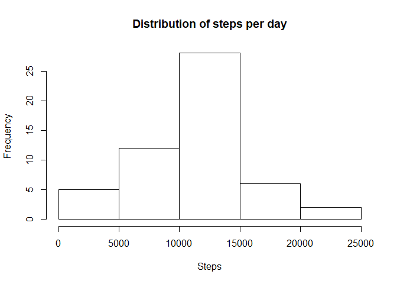
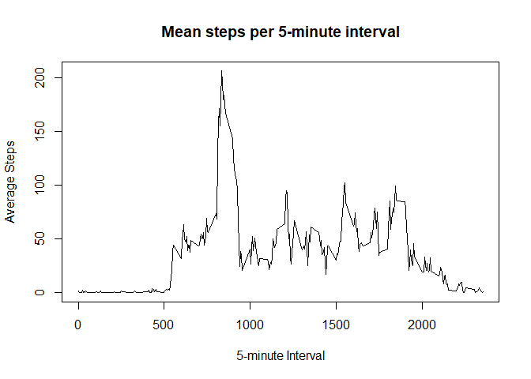
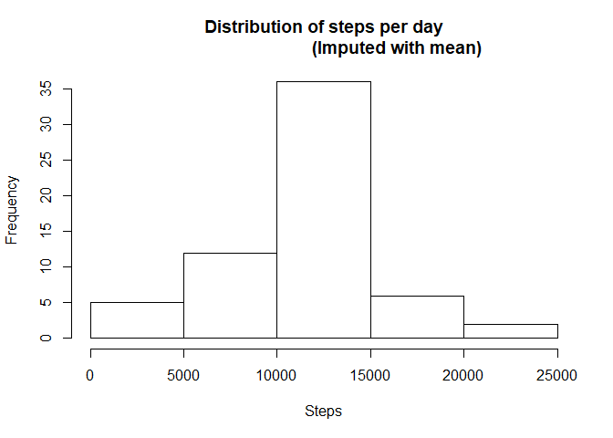
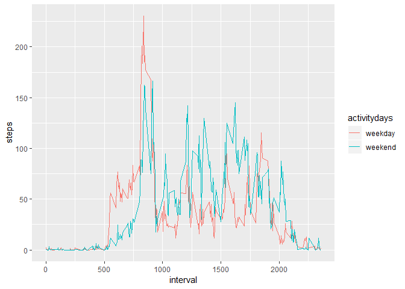

This project will load and analyze some steps data from the activity.csv
file.

------------------------------------------------------------------------

### Loading and preprocessing the data

Let's begin our analysis by loading in the activity.csv file from inside
the activity.zip file.

    activity <- read.csv(unz("activity.zip", "activity.csv"))

------------------------------------------------------------------------

### What is mean total number of steps taken per day?

Now we can calculate the total number of stes taken each day.

    totalsteps <- aggregate(steps ~ date, activity, sum) 

Here we can now make our histogram for total steps per day, and
calculate some statistics for the data set.

    with(totalsteps, hist(x = steps, xlab = "Steps",
                          main = "Distribution of steps per day"))

    avg <- mean(totalsteps$steps)
    med <- median(totalsteps$steps)
    cat(sprintf("Mean: %.2f\nMedian: %.2f", avg, med))

    ## Mean: 10766.19
    ## Median: 10765.00

------------------------------------------------------------------------

### What is the average daily activity pattern?

Now let's get the average steps per interval over all days, and plot
them. We also find the interval with the most steps on average, and
print it.

    avgsteps <- aggregate(steps ~ interval, activity, mean) 
    with(avgsteps, plot(interval, steps, type = "l", xlab = "5-minute Interval",
                        ylab = "Average Steps", main = "Mean steps per 5-minute interval"))

    maxint <- with(avgsteps, subset(avgsteps, steps == max(steps)))$interval

The highest steps on average occur during interval 835, which we can
verify from the plot.

------------------------------------------------------------------------

### Imputing missing values

Let's check on the NA values for the data set. First we should count the
number of NAs present.

    NAs <- sum(is.na(activity$steps))

So we have 2304 NA values (13% of our data). Let's replace them with the
means for that interval since we have already calculated those values.
Then we can plot and find the statistics as we did before.

    activitynew <- replace(activity, is.na(activity), values = avgsteps$steps)
    totalstepsnew <- aggregate(steps ~ date, activitynew, sum) 
    with(totalstepsnew, hist(x = steps, xlab = "Steps",
                             main = "Distribution of steps per day
                                    (Imputed with mean)"))

    avgnew <- mean(totalstepsnew$steps)
    mednew <- median(totalstepsnew$steps)
    cat(sprintf("Mean: %.2f\nMedian: %.2f", avgnew, mednew))

    ## Mean: 10766.19
    ## Median: 10766.19

We see that the new imputed plot has a higher frequency near the average
steps per day, which is expected since we added the average in place of
all NA values. We can also see the mean stayed the same (as expected)
and the median became the mean, which means we have more NA values than
old median values, changing the median.

------------------------------------------------------------------------

### Are there differences in activity patterns between weekdays and weekends?

Let's add a column to the activity dataset to indicate whether it is a
weekday or a weekend.

    ## We find all Saturday and Sunday, and set them equal to "weekend". Otherwise
    ##we make them equal to "weekday". We then convert to a factor and bind the col.
    activitydays <- as.factor(ifelse(
        weekdays(strptime(activitynew$date, format = "%Y-%m-%d")) == "Saturday" |
        weekdays(strptime(activitynew$date, format = "%Y-%m-%d")) == "Sunday",
        "weekend", "weekday"))
    activitynew <- cbind(activitynew, activitydays)

Now we can plot the weekdays and weekend days to compare the activity.
We will use ggplot to simplify the grouping.

    require(ggplot2)

    ## Loading required package: ggplot2

    avgstepsdays <- aggregate(steps ~ interval + activitydays, activitynew, mean)
    qplot(interval, steps, data = avgstepsdays, col = activitydays, geom = "line")

We can see that on weekends, fewer steps are taken early as people will
sleep in on weekends. There are also more steps during the day and later
as people tend to move around rather than sit at work.
